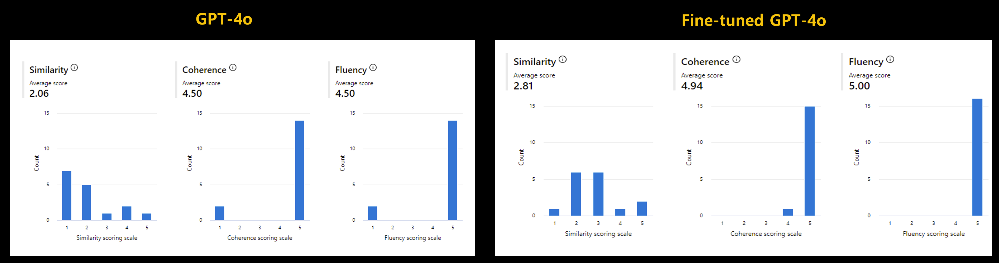
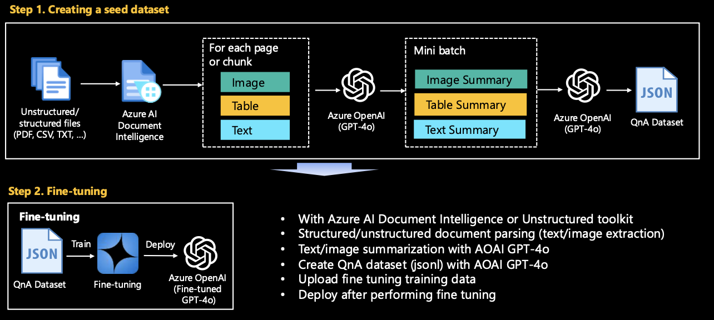
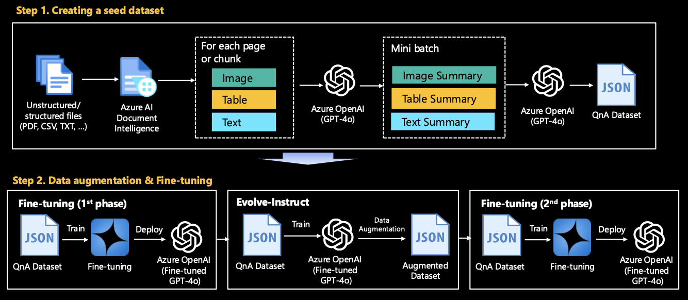
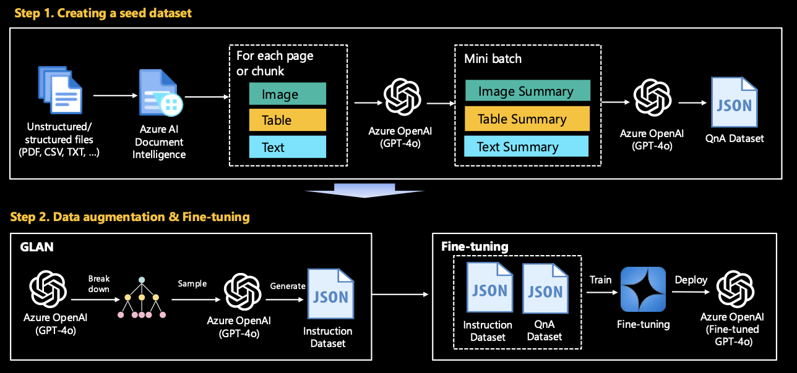

# Generate Synthetic QnAs from Real-world Data 

## Overview
For LLM/SLM fine-tuning, RAG, or evaluation, it is often necessary to generate data in Q&A format from real-world raw data. However, in scenarios where you need to create a dataset from scratch, rather than from a ready-made dataset, you will face many challenges.

This hands-on lab aims to alleviate some of that headache by demonstrating how to create/augment a QnA dataset from complex unstructured data, assuming a real-world scenario. The sample aims to be step-by-step for developers and data scientists, as well as those in the field, to try it out with a little help.

## Scenario

### Overview
We aims to enhance the model's performance by fine-tuning/RAG (Retrieval-Augmented Generation), providing a high-quality dataset. However, no pre-existing dataset is provided; we only have unprocessed raw data in formats such as PDF, CSV, and TXT. This raw data consists of a mixture of images, tables, and text.

#### Stage 1. Constructing a seed dataset 
The task is to preprocess and convert this heterogeneous data into a structured format suitable for fine-tuning or RAG. This involves extracting and cleaning text from various file formats, converting tables and images to text using Azure AI Services if necessary. This dataset is used as a seed dataset for fine tuning or RAG and is used as a baseline to improve the performance of domain-specific use cases.

#### Stage 2. Data Augmentation (Optional)
After fine-tuning with the generated dataset, a baseline was established, but the performance requires improvement due to lack of data (e.g., there are only 1,000 samples in the dataset). In this case, a synthetic dataset must be created by applying data augmentation techniques to enhance performance. The data augmentation technique utilizes the representative techniques announced by Microsoft: Evol-Instruct, GLAN (Generalized Instruction Tuning), and Auto Evol-Insruct.

### Customer application examples
Below is a comparison of the results before and after fine tuning of GPT-4o without RAG for customer PoC. GPT-4o is available to a small number of customers as a private preview as of July 2024. This is the result of creating a set of 16 questions and answers for PoC and comparing three indicators of **Similarity, Coherence, and Fluency** in Azure AI studio. The values ​​of the indicator are on a scale of 1-5, with higher values ​​being better.

## Requirements
Before starting, you have met the following requirements:

- Access to Azure OpenAI Service - you can apply for access [here](https://go.microsoft.com/fwlink/?linkid=2222006)
- An Azure AI Studio project - go to [aka.ms/azureaistudio](https://aka.ms/azureaistudio) to create a project
- Azure AI Document Intelligence (v4.0 - 2024-02-29 preview) - Find out more [here](https://learn.microsoft.com/en-us/azure/ai-services/document-intelligence/overview?view=doc-intel-4.0.0)

Please do not forget to modify the `.env` file to match your account. Rename `.env.sample` to `.env` or copy and use it

## Contents

### Stage 1. Constructing a seed dataset 

Convert the given raw data into data that can be used for model training/RAG/evaluation using Azure OpenAI GPT-4o. `make_qa_multimodal_pdf_docai.ipynb` is most recommended. However, if you feel that the logic of this code is complicated, or if your file content consists only of images or text, please try looking at other Jupyter notebooks first.
Run the Jupyter notebook in the **[seed](seed)** folder.

#### PDF
- `make_qa_multimodal_pdf_docai.ipynb`: (Recommended) Generate QnA synthetic dataset from a Complex PDF using Azure AI Document Intelligence.
- `make_qa_multimodal_pdf_oss.ipynb`:  Generate QnA synthetic dataset from a Complex PDF using Open source (Unstructured toolkit for this hands-on). To run this file, you first need to install the required packages with `startup_unstructured.sh`. The installation will take a few minutes.
- `make_qa_only_image_multiple_pdf.ipynb`: Generate QnA synthetic dataset from multiple PDFs - Image-heavy PDF.
- `make_qa_only_image_pdf.ipynb`: Generate QnA synthetic dataset from a PDF - Image-heavy PDF.

#### CSV
- `make_qa_csv.ipynb`: This is the general case. It is not difficult to create a QnA dataset by reading and chunking with CSVLoader.
- `make_qa_image_url_csv.ipynb`: This is another common case. If image url information is included, change this url to a summary result for that image.

### Stage 2. Data Augmentation (Optional)
Leverage Microsoft's research to generate more high-quality and complex data. Once you have established a baseline in Stage 1, experiment with this step for even better results. By utilizing the concepts of Evolve-Instruct and GLAN, you can fine tune into your LLM specialized for a specific industry/technology domain.

#### [Evolve-Instruct](evolve-instruct/README.md)

We can perform data augmentation based on the seed dataset created in Stage 1. Please see **[evolve-instruct/README](evolve-instruct/README.md)** for more details.

#### [GLAN (Generalized Instruction Tuning)](glan-instruct/README.md)

GLAN can be performed independently without the need to go through Stage 1. This is because it covers all generalized domains. Please see **[glan-instruct/README](glan-instruct/README.md)** for more details.

## How to get started 
Any option is fine, but you may wish to refer to the instructions below:
- For engineers or practitioners in the field who want to use this hands-on in PoC/MVP, we recommend Option 1.
- For instructors who want to use this hands-on in their workshops, we recommend Option 2.
- For developers in the field who want to launch a production, we recommend Option 3.

### Option 1. Azure AI Studio or Azure ML Studio
Create your compute instance. For code development, we recommend `Standard_DS11_v2` (2 cores, 14GB RAM, 28GB storage, No GPUs).

If you want to use the Unstructured toolkit for processing a complex PDF, please be sure to include `startup_unstructured.sh` in your instance startup script.

### Option 2. GitHub Codespace
Please start a new project by connecting to Codespace Project. The environment required for hands-on is automatically configured through devcontainer, so you only need to run a Jupyter notebook.

### Option 3. Your local PC
Please start by installing the required packages on your local PC with `pip install -r requirements.txt`

## References
- Evolve-Instruct: https://arxiv.org/pdf/2304.12244
- GLAN (Generalized Instruction Tuning): https://arxiv.org/pdf/2402.13064
- Auto Evolve-Instruct: https://arxiv.org/pdf/2406.00770

## Contributing

This project welcomes contributions and suggestions.  Most contributions require you to agree to a
Contributor License Agreement (CLA) declaring that you have the right to, and actually do, grant us
the rights to use your contribution. For details, visit https://cla.opensource.microsoft.com.

When you submit a pull request, a CLA bot will automatically determine whether you need to provide
a CLA and decorate the PR appropriately (e.g., status check, comment). Simply follow the instructions
provided by the bot. You will only need to do this once across all repos using our CLA.

This project has adopted the [Microsoft Open Source Code of Conduct](https://opensource.microsoft.com/codeofconduct/).
For more information see the [Code of Conduct FAQ](https://opensource.microsoft.com/codeofconduct/faq/) or
contact [opencode@microsoft.com](mailto:opencode@microsoft.com) with any additional questions or comments.

## Trademarks

This project may contain trademarks or logos for projects, products, or services. Authorized use of Microsoft 
trademarks or logos is subject to and must follow 
[Microsoft's Trademark & Brand Guidelines](https://www.microsoft.com/en-us/legal/intellectualproperty/trademarks/usage/general).
Use of Microsoft trademarks or logos in modified versions of this project must not cause confusion or imply Microsoft sponsorship.
Any use of third-party trademarks or logos are subject to those third-party's policies.

## License Summary
This sample code is provided under the MIT-0 license. See the LICENSE file.