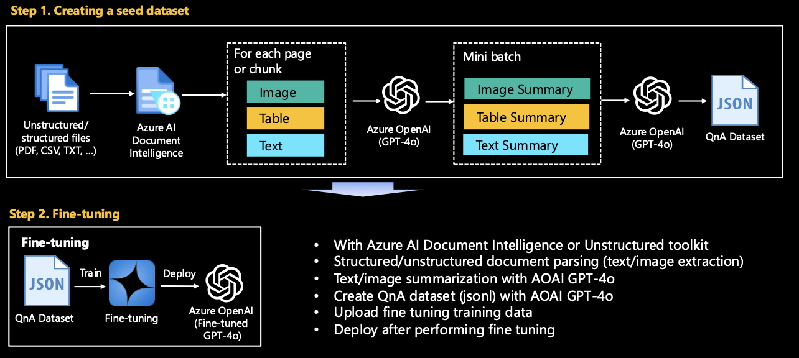

# Generate Coverage dataset (seed data)

## Overview
The task is to preprocess and convert this heterogeneous data into a structured format suitable for fine-tuning or RAG. This involves extracting and cleaning text from various file formats, converting tables and images to text using Azure AI Services if necessary. This dataset is used as a seed dataset for fine tuning or RAG and is used as a baseline to improve the performance of domain-specific use cases.

{: .note}
This implementation is just baseline for ideation, not for production. You need to customize the code for your own data.

## Getting started

Convert the given raw data into data that can be used for model training/RAG/evaluation using Azure OpenAI GPT-4o. `make_qa_multimodal_pdf_docai.ipynb` is most recommended. However, if you feel that the logic of this code is complicated, or if your file content consists only of images or text, please try looking at other Jupyter notebooks first.
Run the Jupyter notebook in the **[seed](seed)** folder.

#### PDF
- `make_qa_multimodal_pdf_docai.ipynb`: (Recommended) Generate QnA synthetic dataset from a Complex PDF using Azure AI Document Intelligence.
- `make_qa_multimodal_pdf_oss.ipynb`:  Generate QnA synthetic dataset from a Complex PDF using Open source (Unstructured toolkit for this hands-on). To run this file, you first need to install the required packages with `startup_unstructured.sh`. The installation will take a few minutes.
- `make_qa_only_image_multiple_pdf.ipynb`: Generate QnA synthetic dataset from multiple PDFs - Image-heavy PDF.
- `make_qa_only_image_pdf.ipynb`: Generate QnA synthetic dataset from a PDF - Image-heavy PDF.

#### CSV
- `make_qa_csv.ipynb`: This is the general case. It is not difficult to create a QnA dataset by reading and chunking with CSVLoader.